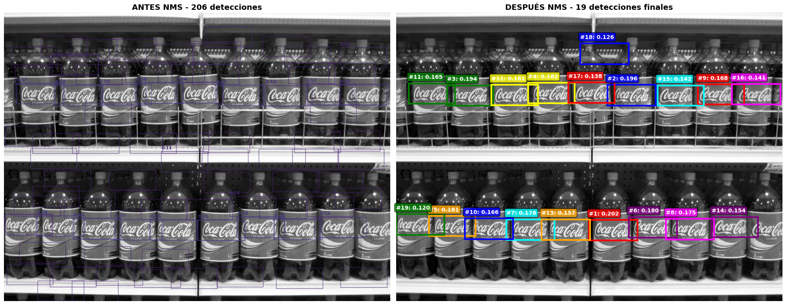
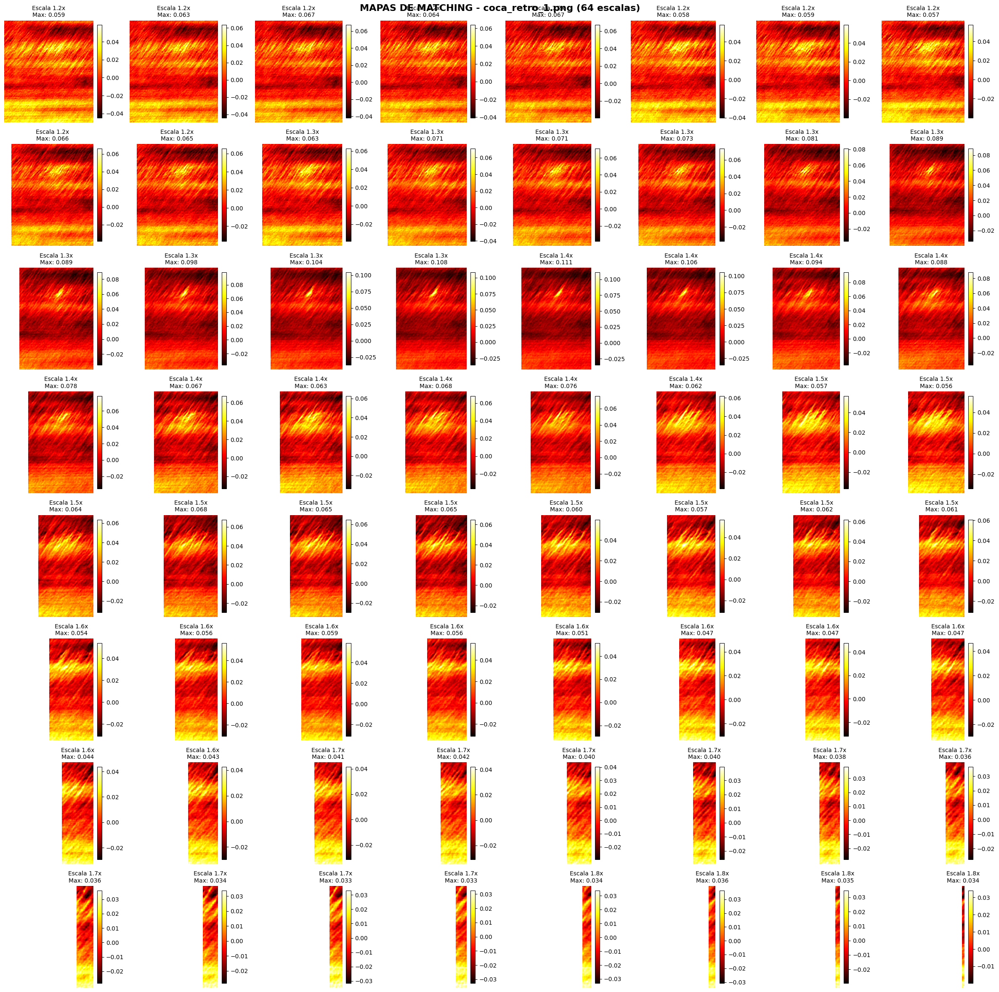
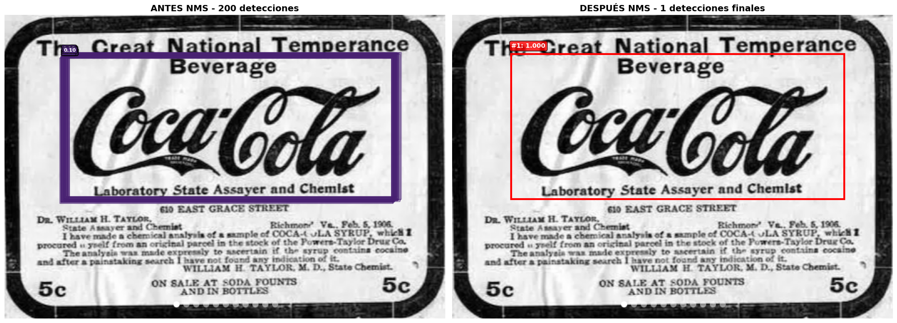

# TP3 - Template Matching con Filtro Canny

## Descripción del Proyecto

Este proyecto implementa algoritmos de detección de logos utilizando template matching con preprocesamiento Canny para diferentes escenarios:

1. **Pregunta 1**: Detección simple de logo (una detección por imagen)
2. **Pregunta 2**: Detección múltiple en imagen específica (coca_multi.png)
3. **Pregunta 3**: Generalización del algoritmo para todas las imágenes

## Resultados por Pregunta

### Pregunta 1: Detección Simple de Logo

**Objetivo**: Encontrar el logotipo de la gaseosa dentro de las imágenes provistas usando template matching, obteniendo una detección del logo en cada imagen sin falsos positivos.

**Metodología**:
- Template matching con múltiples escalas
- Preprocesamiento con filtros Canny
- Non-Maximum Suppression (NMS) para eliminar detecciones redundantes
- Configuración de umbrales para evitar falsos positivos

**Ejemplo de procesamiento - coca_logo_1.png**:


*Fase 1: Entradas del algoritmo - template original y con filtro Canny, imagen objetivo*


*Fase 2: Mapas de matching en diferentes escalas*


*Fase 3: Mejor detección encontrada con bounding box*


*Fase 4: Comparación de resultados en diferentes escalas*

### Pregunta 2: Detección Múltiple de Logos

**Objetivo**: Plantear y validar un algoritmo para múltiples detecciones en la imagen coca_multi.png utilizando el mismo template de la pregunta 1.

**Metodología**:
- Algoritmo optimizado para detectar múltiples instancias del logo
- Non-Maximum Suppression (NMS) para eliminar detecciones redundantes
- Visualización con bounding boxes y niveles de confianza

**Ejemplo de procesamiento - coca_multi.png**:


*Fase 1: Entradas del algoritmo para detección múltiple*


*Fase 2: Mapas de matching para múltiples detecciones*


*Fase 3: Comparación de escalas para optimización*


*Fase 4: Comparación entre detecciones candidatas y finales*


*Fase 5: Detecciones finales numeradas con niveles de confianza*

### Pregunta 3: Generalización del Algoritmo

**Objetivo**: Generalizar el algoritmo de detección múltiple del ítem 2 para todas las imágenes del directorio, visualizando los resultados con bounding boxes y niveles de confianza.

**Metodología**:
- Aplicar el algoritmo de detección múltiple a todo el conjunto de imágenes
- Configuración balanceada que funcione para diferentes tipos de imágenes
- Análisis comparativo de resultados entre imágenes
- Visualización completa con métricas de rendimiento

**Ejemplo de procesamiento generalizado - coca_retro_1.png**:


*Fase 1: Entradas del algoritmo generalizado*


*Fase 2: Mapas de matching con configuración generalizada*


*Fase 3: Análisis de escalas para algoritmo generalizado*


*Fase 4: Comparación de detecciones en modo generalizado*


*Fase 5: Resultado final con detecciones numeradas*

## Estructura del Proyecto

```
├── TP3_Pregunta1_DeteccionSimple.ipynb    # Notebook Pregunta 1
├── TP3_Pregunta2_DeteccionMultiple.ipynb  # Notebook Pregunta 2
├── TP3_Pregunta3_GeneralizacionAlgoritmo.ipynb # Notebook Pregunta 3
├── template_matching_lib/                 # Librería de funciones
├── resultados_canny/                      # Resultados Pregunta 1
├── resultados_canny_multi/                # Resultados Pregunta 2
└── resultados_test_general/               # Resultados Pregunta 3
```

## Tecnologías Utilizadas

- **OpenCV**: Para procesamiento de imágenes y template matching
- **NumPy**: Para operaciones matriciales
- **Matplotlib**: Para visualización de resultados

## Configuración

Las configuraciones específicas para cada experimento se encuentran en el módulo `template_matching_lib.config` con parámetros optimizados para cada tipo de detección.
